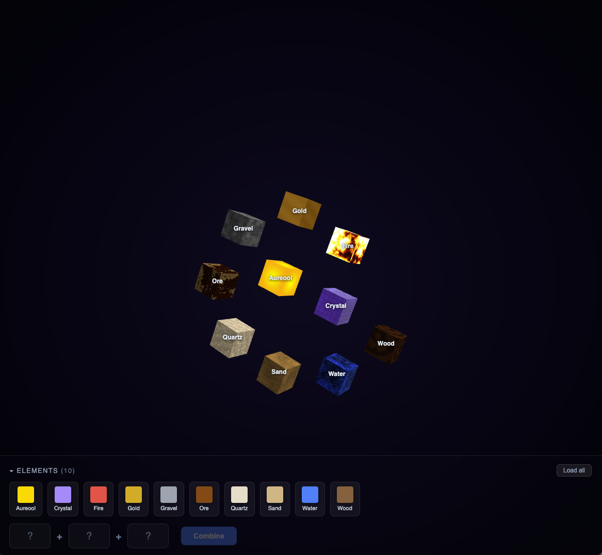

# AI Forging Game



An interactive 3D element-combining game built with Three.js. Start with base elements like Water, Fire, Sand, and Gold — then combine them to discover new ones, 100% made and powered by AI.

## Features

- **3D Element Cubes** — Each element is rendered as a rotating cube with a unique shader (water caustics, fire flames, metallic gold, wood grain, etc.)
- **AI-Powered Combining** — Select 2–3 elements and combine them. An AI generates the result, including a custom shader, description, and Wikipedia link
- **Combine Animation** — Elements orbit, merge with a particle burst and flash effect, then the new element fades in
- **Element Info** — Click any cube to view its description and Wikipedia image
- **Spiral Layout** — Elements are arranged in an Archimedean spiral that slowly rotates

## Tech Stack

- Claude CLI
- [Three.js](https://threejs.org/) — 3D rendering with custom GLSL shaders
- [Vite](https://vitejs.dev/) — Build tooling
- TypeScript

## Getting Started

Claude CLI must be installed.

```bash
# Install dependencies
yarn

# Start dev server
`yarn dev` or `bun run dev`
```

## Usage

- Command + Click to select 3d elements or open de elements explorer to select.
- Let Claude figure out the net element by combining two or three elements.

## Project Structure

```
src/
├── main.ts       # Scene setup, animation loop, combine animation
├── ui.ts         # Inventory panel, combine slots, result/info modals
├── elements.ts   # Element store with starter elements
├── api.ts        # Backend API calls (combine, cache)
├── shaders.ts    # GLSL fragment shaders per element
└── types.ts      # Element type definition
```
